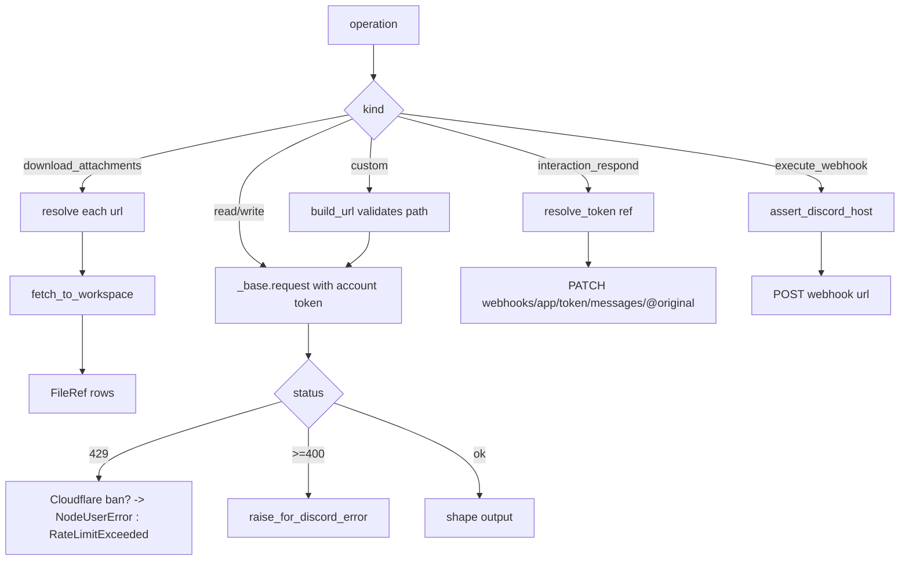

# Discord (`discordAction`)

| Field | Value |
|------|-------|
| **Category** | discord |
| **Backend handler** | [`server/nodes/discord/discord_action.py`](../../../server/nodes/discord/discord_action.py) (`DiscordActionNode`, on `AccountScopedNode`) |
| **Tests** | [`server/tests/nodes/test_discord.py`](../../../server/tests/nodes/test_discord.py) |
| **Skill (if any)** | none |
| **Dual-purpose tool** | yes — tool name `discord` |

## Purpose

The REST surface beyond sending: servers, channels, messages, reactions,
threads. Also the two operations that exist for structural reasons rather than
API symmetry — `download_attachments` (because a deployed trigger never runs
its node body) and `interaction_respond` (because the interaction token must
never travel through node output).

## Inputs (handles)

| Handle | Connection type | Required | Purpose |
|--------|-----------------|----------|---------|
| `input-main` | main | no | Upstream data; typically a `discordReceive` payload |

## Parameters

| Name | Type | Default | Required | displayOptions.show | Description |
|------|------|---------|----------|---------------------|-------------|
| `operation` | enum (14) | `list_channels` | yes | – | See below |
| `account_id` | string | `""` | no | – | Which bot acts. **Stripped from model arguments.** |
| `guild_id` | string | `""` | yes* | `list_channels` | Server snowflake |
| `channel_id` | string | `""` | yes* | most ops | Channel snowflake |
| `message_id` | string | `""` | yes* | message ops | Message snowflake |
| `content` | string | `""` | yes* | `edit_message` | Replacement body |
| `emoji` | string | `""` | yes* | `add_reaction` | Unicode emoji or `name:id` |
| `thread_name` | string | `""` | yes* | `create_thread` | New thread name |
| `limit` | int (1–100) | `50` | no | `list_messages` | Page size |
| `attachments` | list[dict] | `[]` | yes* | `download_attachments` | Rows from a trigger |
| `interaction_ref` | string | `""` | yes* | `interaction_respond` | Opaque handle from `discordInteraction` |
| `interaction_message` | string | `""` | yes* | `interaction_respond` | Response body |
| `webhook_url` | password | `""` | yes* | `execute_webhook` | Discord webhook URL |
| `webhook_content` | string | `""` | yes* | `execute_webhook` | Body |
| `method` / `path` / `body` | – | – | yes* | `custom` | Raw route escape hatch |

Operations: `list_guilds`, `list_channels`, `get_channel`, `create_thread`,
`list_messages`, `get_message`, `edit_message`, `delete_message`,
`add_reaction`, `pin_message`, `download_attachments`, `interaction_respond`,
`execute_webhook`, `custom`.

## Outputs (handles)

| Handle | Shape | Description |
|--------|-------|-------------|
| `output-main` | object | `DiscordActionOutput` |
| `output-tool` | – | Auto-appended |

### Output payload (TypeScript shape)

```ts
{
  result?: object;   // single-object responses
  items: any[];      // list responses, so the declared shape stays an object
  count?: number;
  files: FileRef[];  // download_attachments; references, never bytes
}
```

## Logic Flow



## Decision Logic

- **Validation**: every id/name goes through `_require`, which raises
  `NodeUserError` naming the missing field.
- **`custom` paths** are validated in `_base.build_url` — relative only, no
  scheme, no `//`, no `..`. The guard lives there, not at the call site, so no
  future caller can skip it; without it this operation would send the bot token
  to any host a workflow named.
- **`download_attachments`** never claims `kind="audio"`: that asserts a real
  container probe and a download measures nothing. Rows without a `url` are
  skipped rather than failing the batch.
- **`interaction_respond`** PATCHes `@original` because the endpoint already
  deferred within Discord's three-second window; an unknown or expired ref is a
  `NodeUserError` naming the 15-minute limit.
- **Error paths**: auth → annotated `PermissionError` (credential envelope +
  reconnect affordance); permission/not-found → `NodeUserError` (terminal);
  429/5xx → `RuntimeError` (retryable).

## Side Effects

- **File I/O**: `download_attachments` writes into the workflow workspace via
  `fetch_to_workspace` (SSRF guard, streaming, 25 MB cap, contained write).
- **External API calls**: many; all through `_base` except the two that carry
  their own auth (webhook URL, interaction token), which deliberately bypass
  the account path.

## External Dependencies

- **Credentials**: `DiscordBotCredential`; the webhook and interaction routes
  carry their own auth and use none.
- **Python packages**: `httpx`.

## Edge cases & known limits

- List responses can be large; `limit` caps messages at 100. `BaseNode`
  warns at 512 KB and hard-fails at the 2 MiB Temporal ceiling.
- Webhook URLs and interaction URLs are never echoed in errors — both embed
  credentials.
- `interaction_ref` does not survive a restart, by design.

## Related

- **Consumes**: `discordReceive.attachments`, `discordInteraction.interaction_ref`.
- **Architecture docs**: [discord_service.md](../../discord_service.md),
  [media_transport.md](../../media_transport.md)
