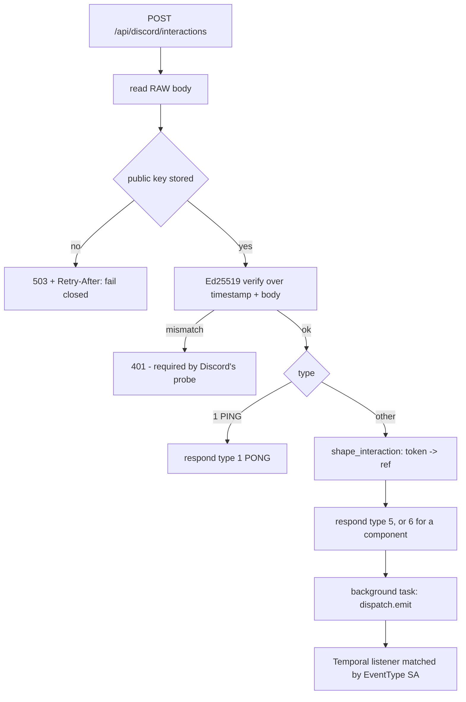

# Discord Interaction (`discordInteraction`)

| Field | Value |
|------|-------|
| **Category** | discord / trigger |
| **Backend handler** | [`server/nodes/discord/discord_interaction.py`](../../../server/nodes/discord/discord_interaction.py); endpoint in [`_router.py`](../../../server/nodes/discord/_router.py), shaping + token store in [`_interactions.py`](../../../server/nodes/discord/_interactions.py), signatures in [`_verifier.py`](../../../server/nodes/discord/_verifier.py) |
| **Tests** | [`server/tests/nodes/test_discord.py`](../../../server/tests/nodes/test_discord.py) |
| **Skill (if any)** | none |
| **Dual-purpose tool** | no (trigger) |

## Purpose

Fire on a slash command, component click or modal submit. Interactions arrive
over HTTP at `POST /api/discord/interactions[/{account_id}]`, are Ed25519
verified, acknowledged inside Discord's three-second deadline, and emitted as
`com.opencompany.discord.interaction.created`.

A second trigger node rather than a mode on `discordReceive`:
`canary_registry` maps one node type to exactly one CloudEvents type, because
that string becomes the Temporal `EventType` Search Attribute the listener is
found by. One node cannot subscribe to both.

## Inputs (handles)

None — this is a trigger.

## Parameters

| Name | Type | Default | Required | displayOptions.show | Description |
|------|------|---------|----------|---------------------|-------------|
| `account_id` | string | `""` | no | – | Which app to accept interactions for |
| `interaction_kind` | `all \| command \| component \| modal` | `all` | no | – | Maps to Discord types 2 / 3 / 5 |
| `command_name` | string | `""` | no | `all\|command` | Leading `/` is tolerated |
| `custom_id` | string | `""` | no | `all\|component\|modal` | Component identifier |
| `guild_id` | string | `""` | no | – | Only this server |

## Outputs (handles)

| Handle | Shape | Description |
|--------|-------|-------------|
| `output-main` | object | `DiscordInteractionOutput` |

### Output payload (TypeScript shape)

```ts
{
  account_id: string;
  interaction_id: string;
  interaction_type: number;      // 2 command, 3 component, 5 modal
  application_id: string;
  command_name?: string;
  custom_id?: string;
  component_type?: number;
  options: Record<string, unknown>;   // slash-command options, flattened
  channel_id?: string; guild_id?: string;
  user_id?: string; user_name?: string;
  interaction_ref: string;       // opaque handle. NEVER the token.
}
```

## Logic Flow



## Decision Logic

- **401, not 400, on a bad signature.** Discord's endpoint-validation probe
  sends an invalid signature on purpose and refuses to save the URL unless it
  gets a 401. This is why the generic `WebhookSource` intake cannot host this
  endpoint — it raises 400.
- **Fail closed with 503** when no public key is stored; accepting unverified
  requests would let anyone trigger workflows.
- **Defer, then work.** A workflow cannot run in three seconds, so the endpoint
  ACKs and fans out afterwards. A component defers as type 6
  (`DEFERRED_UPDATE_MESSAGE`) so the existing message is edited rather than an
  empty new one being posted.
- **Verification is over the raw body**, never re-serialised JSON: any change
  in key order or separators breaks authentic requests.
- **Per-account paths** avoid trial-verifying against every stored public key,
  which would be a timing oracle and an availability multiplier.

## Side Effects

- **In-memory**: `interaction_ref -> (application_id, token)` in a TTL map
  (14 minutes, just inside Discord's 15).
- **Broadcasts**: `discord_interaction_created`.

## External Dependencies

- **Credentials**: `discord_public_key` on the account's credential scope.
- **Python packages**: `cryptography` (already a dependency). **Not PyNaCl.**

## Edge cases & known limits

- **Gateway and HTTP delivery are mutually exclusive per application.** Setting
  an Interactions Endpoint URL stops `INTERACTION_CREATE` over the socket.
- The interaction token never appears in node output — it is a bearer
  credential and trigger output is persisted, broadcast and replayed into LLM
  context. `discordAction[interaction_respond]` trades the ref back.
- Refs do not survive a restart. A workflow that outlived one mid-interaction
  has already missed the 15-minute window.
- Requires a publicly reachable server.
- Must appear in both trigger frozensets or deploy ignores it silently.

## Related

- **Downstream**: `discordAction[interaction_respond]` completes the reply.
- **Architecture docs**: [discord_service.md](../../discord_service.md)
