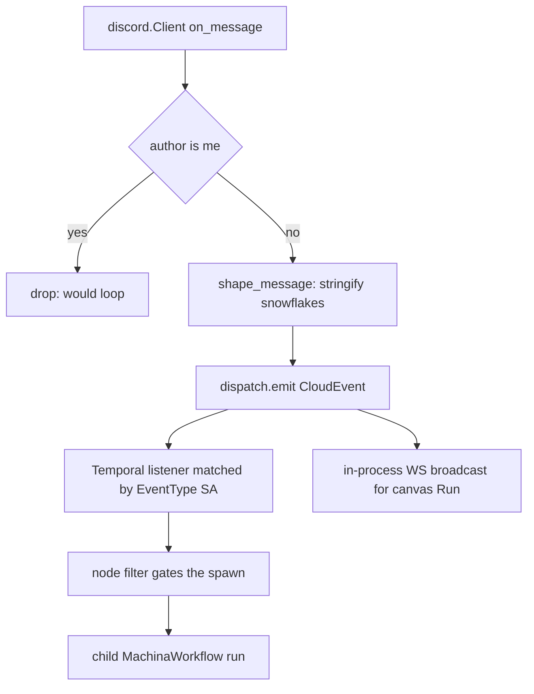

# Discord Receive (`discordReceive`)

| Field | Value |
|------|-------|
| **Category** | discord / trigger |
| **Backend handler** | [`server/nodes/discord/discord_receive.py`](../../../server/nodes/discord/discord_receive.py); connection in [`_gateway.py`](../../../server/nodes/discord/_gateway.py), shaping in [`_dispatch.py`](../../../server/nodes/discord/_dispatch.py), filtering in [`_filters.py`](../../../server/nodes/discord/_filters.py) |
| **Tests** | [`server/tests/nodes/test_discord.py`](../../../server/tests/nodes/test_discord.py) |
| **Skill (if any)** | none |
| **Dual-purpose tool** | no (trigger) |

## Purpose

Fire when a message arrives in a server channel or a DM. Messages come over a
persistent gateway connection held per bot account, are flattened, and emitted
as CloudEvents of type `com.opencompany.discord.message.received`.

## Inputs (handles)

None — this is a trigger; it is the head of a run.

## Parameters

| Name | Type | Default | Required | displayOptions.show | Description |
|------|------|---------|----------|---------------------|-------------|
| `account_id` | string | `""` | no | – | Which bot listens |
| `scope` | `all \| guild \| dm` | `all` | no | – | Server channels, DMs, or both |
| `guild_id` | string | `""` | no | `scope=all\|guild` | Only this server |
| `channel_id` | string | `""` | no | – | Only this channel |
| `author_id` | string | `""` | no | – | Only this user |
| `keywords` | string | `""` | no | – | Comma-separated; fires if any appears |
| `require_mention` | bool | `false` | no | – | Only when the bot is mentioned |
| `require_attachment` | bool | `false` | no | – | Only messages with a file |
| `ignore_bots` | bool | `true` | no | – | Off invites bot-to-bot loops |

## Outputs (handles)

| Handle | Shape | Description |
|--------|-------|-------------|
| `output-main` | object | `DiscordReceiveOutput` |

### Output payload (TypeScript shape)

```ts
{
  account_id: string;
  message_id: string;          // every snowflake is a STRING
  channel_id: string; channel_name?: string;
  guild_id?: string; guild_name?: string;
  is_dm: boolean;              // guild_id is null for a DM
  author_id: string; author_name?: string;
  author_display_name?: string; author_is_bot: boolean;
  content: string;             // empty without the Message Content intent
  timestamp?: string;
  attachments: Array<{ id, filename, size, url, content_type, width?, height? }>;
  has_attachments: boolean;
  mentions_me: boolean;
  reply_to_message_id?: string;
}
```

## Logic Flow



## Decision Logic

- **Self-messages are dropped** at the gateway handler — a workflow that
  replies would otherwise trigger itself.
- **Filtering** is built once at deploy time and closes over its parameters;
  the per-event path is plain comparisons. Account scoping is not a
  convenience: without it, connecting a second bot makes every trigger fire
  twice.
- **Run-button pre-flight**: `execute` refuses when no gateway is connected for
  the selected account, rather than registering a waiter that can never
  resolve (which reads as a hung node). `precheck_discord_trigger` does the
  same for deploy.
- **Error paths**: one malformed message is logged and dropped; it must not
  kill the receive loop.

## Side Effects

- **Broadcasts**: `plugin_connection_status` on connect/disconnect;
  `discord_message_received` per message.
- **External**: a persistent WSS gateway connection per account.

## External Dependencies

- **Credentials**: `DiscordBotCredential`.
- **Python packages**: `discord.py` (imported inside functions only —
  `nodes/__init__.py` swallows import errors, so a module-scope import would
  make the whole plugin vanish silently).

## Edge cases & known limits

- **`content` is empty without the Message Content privileged intent**, with no
  error anywhere. The credential probe reports the flag; this is the single
  most confusing failure mode.
- Attachments are metadata only. `discordAction[download_attachments]` fetches
  them, because a deployed trigger never runs its node body.
- CDN URLs are signed and expire; do not persist one and fetch it later.
- Snowflakes are strings. A numeric comparison past 2^53 collapses distinct
  ids (see commit `20d00a07`).
- Must appear in both `EVENT_TRIGGER_TYPES` and `WORKFLOW_TRIGGER_TYPES` or
  deploy silently ignores the node.

## Related

- **Downstream**: `discordAction` (download attachments), `discordSend` (reply).
- **Architecture docs**: [discord_service.md](../../discord_service.md),
  [event_framework.md](../../event_framework.md)
