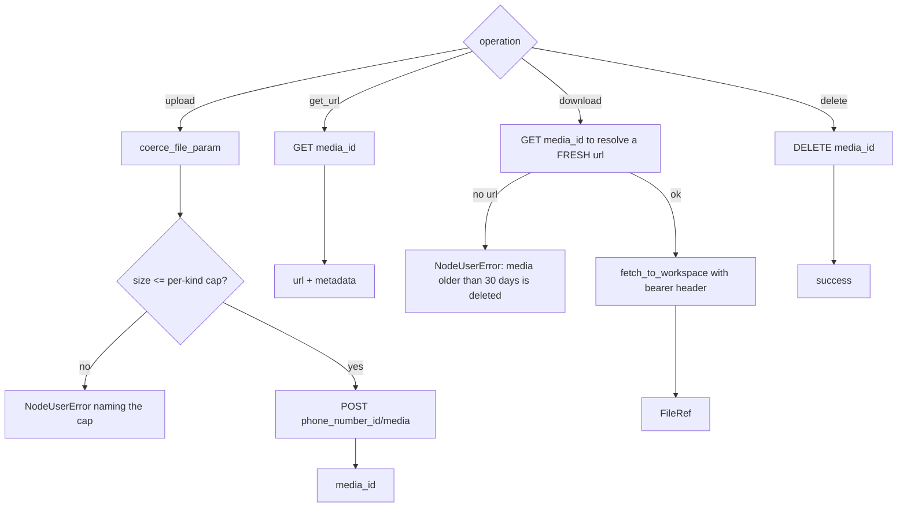

# WhatsApp Business Media (`whatsappBusinessMedia`)

| Field | Value |
|------|-------|
| **Category** | whatsapp_business / tool (dual-purpose) |
| **Backend handler** | [`server/nodes/whatsapp_business/whatsapp_business_media.py`](../../../server/nodes/whatsapp_business/whatsapp_business_media.py) (`WhatsAppBusinessMediaNode`) |
| **Tests** | [`server/tests/nodes/test_whatsapp_business.py`](../../../server/tests/nodes/test_whatsapp_business.py) |
| **Skill (if any)** | none |
| **Dual-purpose tool** | yes - tool name `whatsapp_business_media` |

## Purpose

Upload media to WhatsApp, resolve or download media from an inbound message,
and delete it. This is the one part of the Cloud API surface that is a
**genuinely separate endpoint family** (`POST /{phone-number-id}/media`,
`GET`/`DELETE /{media-id}`), which is why it stays its own node while every
message type collapsed into `whatsappBusinessSend`.

It exists as a node rather than an `auto_download` flag on the trigger for two
reasons: shaping runs inside the webhook request, where Meta expects a prompt
200 and retries anything slower; and the deployed trigger path never runs the
node body, so a download there would be unreachable once deployed. Wiring
`whatsappBusinessReceive -> whatsappBusinessMedia` keeps the fetch on the
workflow's own time.

## Inputs (handles)

| Handle | Connection type | Required | Purpose |
|--------|-----------------|----------|---------|
| `input-main` | main | no | Typically the trigger output, carrying `media.id` |

## Parameters

| Name | Type | Default | Shown when | Description |
|------|------|---------|-----------|-------------|
| `operation` | options | `download` | always | `upload` / `get_url` / `download` / `delete` |
| `media_id` | string | `""` | get_url, download, delete | Inbound messages carry one on `media.id` |
| `file` | file | `null` | upload | Workspace file to upload |
| `mime_type` | string | `""` | upload | Overrides the detected type |

## Outputs (handles)

| Handle | Shape | Description |
|--------|-------|-------------|
| `output-main` | object | Media metadata; `download` adds a workspace `FileRef` |

### Output payload (TypeScript shape)

```ts
{
  media_id?: string;
  url?: string;          // get_url
  mime_type?: string;
  sha256?: string;
  file_size?: number;
  file?: FileRef;        // download - a reference, never bytes
  files?: FileRef[];
  success?: boolean;     // delete
}
```

## Logic Flow



## Decision Logic

- **`download` resolves the URL immediately before fetching**, never trusting
  one carried from an earlier node: Meta's media URLs expire after five
  minutes, so resolving here is what makes the operation survive a retry.
- The media URL is **authenticated despite being signed**, so the bearer token
  is still sent on the fetch.
- Per-kind size caps are enforced **before** upload so an oversize file fails
  locally with a useful message instead of as a generic `131053`.
- `_kind_for` maps `image/webp` to `sticker`; other `image`/`audio`/`video`
  map by MIME prefix; everything else is `document`.

## Side Effects

- **External API calls**: Graph media endpoints, bearer auth.
- **File I/O**: `download` writes into the workflow workspace via
  `fetch_to_workspace`; `upload` reads a workspace file via
  `coerce_file_param` (containment enforced).
- **Cost tracking**: `upload` and `download` declare `cost={...}`.

## External Dependencies

- **Credentials**: `WhatsAppBusinessCredential`.
- **Services**: `services.media` (`coerce_file_param`, `fetch_to_workspace`,
  `preview.preview_kind`).

## Edge cases & known limits

- **Results carry a `FileRef`, never bytes.** A node result is persisted,
  broadcast, retained in status, copied into downstream activity inputs and —
  because this node is agent-callable — serialized into LLM context. A base64
  payload would blow Temporal's blob limit and re-bill the provider on retry.
- **`download` never claims `kind="audio"`.** That kind asserts a real
  container probe (`inspect_audio`), which a download does not perform; a
  fabricated duration would mis-bill per-second providers downstream. It
  returns `image` / `video` / `file` only.
- Meta deletes media after 30 days; `get_url` / `download` then return no URL.
- Size caps: audio/video 16 MB, image 5 MB, sticker 500 KB, document 100 MB.

## Related

- **Architecture docs**: [WhatsApp Business Service](../../whatsapp_business_service.md), [Media Transport](../../media_transport.md)
- **Upstream node**: [`whatsappBusinessReceive`](./whatsappBusinessReceive.md)
