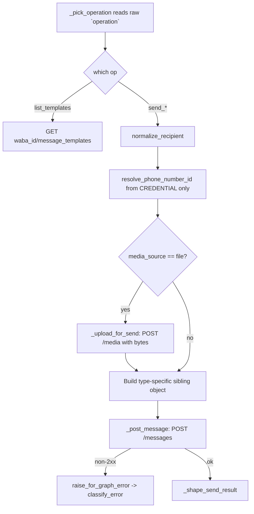

# WhatsApp Business Send (`whatsappBusinessSend`)

| Field | Value |
|------|-------|
| **Category** | whatsapp_business / tool (dual-purpose) |
| **Backend handler** | [`server/nodes/whatsapp_business/whatsapp_business_send.py`](../../../server/nodes/whatsapp_business/whatsapp_business_send.py) (`WhatsAppBusinessSendNode`); one `@Operation` per message type, all through [`_base.graph_post`](../../../server/nodes/whatsapp_business/_base.py) |
| **Tests** | [`server/tests/nodes/test_whatsapp_business.py`](../../../server/tests/nodes/test_whatsapp_business.py) |
| **Skill (if any)** | none |
| **Dual-purpose tool** | yes - tool name `whatsapp_business_send` |

## Purpose

Send any Cloud API message type from the business phone number. Meta models
message type as a **field on a single endpoint**
(`POST /{phone-number-id}/messages`), not as separate endpoints, so text,
media, template and interactive are operations on this one node rather than
separate nodes. `whatsappBusinessTemplate` and `whatsappBusinessInteractive`
were folded in here for that reason.

Distinct from `whatsappSend`, which drives a *personal* account through an
unofficial Go bridge. They share no credential, no node type and no palette
group.

## Inputs (handles)

| Handle | Connection type | Required | Purpose |
|--------|-----------------|----------|---------|
| `input-main` | main | no | Upstream data for template substitution into `to`, `text`, etc. |

## Parameters

`operation` selects the message type; every other field is gated on it via
`displayOptions.show`.

| Name | Type | Default | Shown when | Notes |
|------|------|---------|-----------|-------|
| `operation` | options | `send_text` | always | See the operation table below |
| `to` | string | `""` | all send ops | International format; punctuation stripped by `normalize_recipient` |
| `reply_to_message_id` | string | `""` | text / media / location / contacts | Quotes an inbound message by wamid |
| `text`, `preview_url`, `format_markdown` | | | `send_text` | `format_markdown` converts GFM to WhatsApp syntax |
| `media_type`, `media_source`, `media`, `media_id`, `media_url`, `caption`, `media_filename` | | | `send_media` | `media` also requires `media_source == 'file'` |
| `template_name`, `language_code`, `body_parameters`, `named_parameters`, `header_media_id`, `header_media_type` | | | `send_template` | `template_name` uses `loadOptionsMethod: whatsappBusinessTemplates` |
| `body`, `header`, `footer` | | | the three interactive ops | Caps enforced locally |
| `buttons` | array | `[]` | `send_buttons` | Max 3, title max 20 |
| `list_button_text`, `sections` | | | `send_list` | Max 10 rows **across all sections** |
| `cta_display_text`, `cta_url` | | | `send_cta_url` | |
| `reaction_message_id`, `emoji` | | | `send_reaction` | Empty emoji **removes** a reaction |
| `latitude`, `longitude`, `location_name`, `location_address` | | | `send_location` | Address only rendered alongside a name |
| `contacts` | array | `[]` | `send_contacts` | Each card needs `name.formatted_name` |

There is deliberately **no `phone_number_id` parameter** — see Edge cases.

### Operations

| Operation | `type` sent | Endpoint |
|---|---|---|
| `send_text` | `text` | `{phone_number_id}/messages` |
| `send_media` | `image`/`video`/`audio`/`document`/`sticker` | `{phone_number_id}/messages` (+ `/media` upload when source is `file`) |
| `send_template` | `template` | `{phone_number_id}/messages` |
| `send_buttons` / `send_list` / `send_cta_url` | `interactive` | `{phone_number_id}/messages` |
| `send_reaction` | `reaction` | `{phone_number_id}/messages` |
| `send_location` | `location` | `{phone_number_id}/messages` |
| `send_contacts` | `contacts` | `{phone_number_id}/messages` |
| `list_templates` | — | `GET {waba_id}/message_templates` |

## Outputs (handles)

| Handle | Shape | Description |
|--------|-------|-------------|
| `output-main` | object | Send result, or the template list |

### Output payload (TypeScript shape)

```ts
{
  message_id?: string;      // wamid
  to?: string;              // normalized recipient
  wa_id?: string;
  phone_number_id?: string;
  message_status?: string;
  templates?: Array<{       // list_templates only
    name: string; status: string; category: string;
    language: string; placeholders: number | null;
  }>;
  count?: number;           // list_templates only
}
```

## Logic Flow



## Decision Logic

- **`operation` is load-bearing.** `_pick_operation` reads it from the *raw*
  parameter dict **before** Pydantic validation, so the model default never
  applies at dispatch. Callers building raw dicts must pass it explicitly.
- **Media source is a strict oneOf.** `id` and `link` cannot both be sent, so
  exactly one is built.
- **Caption is dropped for audio and sticker** — Meta rejects it rather than
  ignoring it.
- **Named template params win over positional** — a named template rejects
  positional values with error 132000.
- **Interactive and template never carry `context`**; reaction addresses its
  target via `reaction.message_id` instead.
- **Error paths**: auth (`0`, `190`) → annotated `PermissionError`; throttle /
  transient → `RuntimeError` (retryable); permission / policy / template /
  `131047` (24-hour window closed) → `NodeUserError`.

## Side Effects

- **External API calls**: `graph.facebook.com/v25.0/...`, bearer token from the
  credential.
- **Cost tracking**: each `@Operation` declares a `cost={...}` block.
- **File I/O**: `send_media` with `media_source == 'file'` reads a workspace
  file via `coerce_file_param` (containment enforced).

## External Dependencies

- **Credentials**: `WhatsAppBusinessCredential` — `apiKey` plus
  `whatsapp_business_phone_number_id` and `whatsapp_business_waba_id`.
- **Python packages**: `httpx` (via the plugin `Connection` facade).

## Edge cases & known limits

- **`phone_number_id` is intentionally absent from `Params`.** It selects which
  business identity a message is sent *from*. On a dual-purpose `ActionNode`
  there is no way to protect a declared field: `BaseNode.execute_as_tool` sends
  `{**node_params, **tool_args}`, so model arguments win, and
  `ctx.raw["_raw_parameters"]` is that same merged dict. Sourcing it from the
  credential is the only place the model cannot reach. Locked by
  `TestModelCannotChooseTheSendingNumber`, which drives the real tool path with
  a hostile value.
- The upload posts **bytes, not a file handle** — `Connection.request` replays
  the same kwargs on its one auth retry and a consumed handle would replay
  empty.
- The kind selector is named `media_type`, **not** `message_type`:
  `ParameterRenderer.getFileAcceptType` hardcodes a switch on a sibling named
  `message_type` and would override the backend's `accept`.
- Text body caps at 4096; interactive body at 1024 (Meta's own docs disagree,
  1024 in the OpenAPI spec vs 4096 on the interactive-list page — the smaller is
  used so failures happen at authoring time, not in front of a customer).
- `cta_url` matches Meta's documented CTA payload, but the messages reference
  schema does not enumerate it as an `interactive.type`. Unverified against a
  live send.
- Multi-number sending is deferred.

## Related

- **Architecture docs**: [WhatsApp Business Service](../../whatsapp_business_service.md)
- **Sibling nodes**: [`whatsappBusinessMedia`](./whatsappBusinessMedia.md),
  [`whatsappBusinessReceive`](./whatsappBusinessReceive.md),
  [`whatsappBusinessStatus`](./whatsappBusinessStatus.md)
